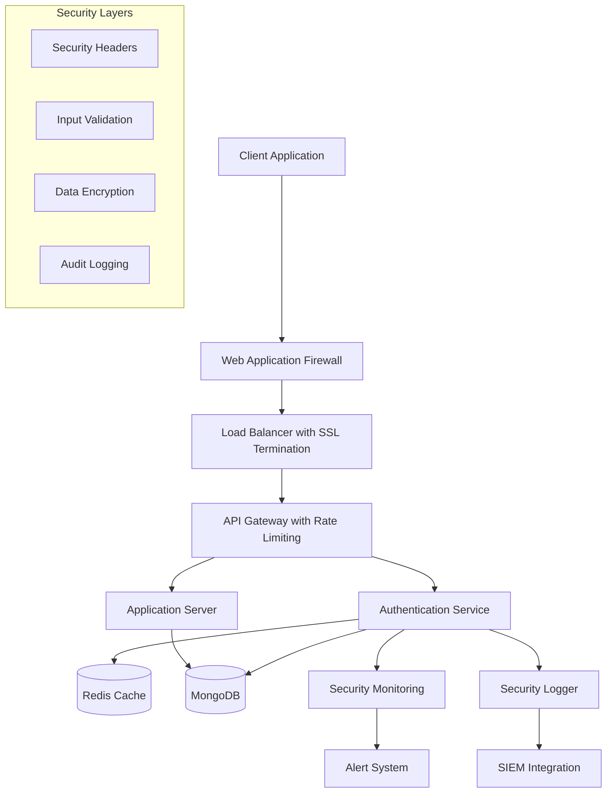

# Design Document

## Overview

This design document outlines the comprehensive security enhancement for the library booking application's authentication system. The design builds upon the existing authentication infrastructure while adding enterprise-grade security features including advanced session management, enhanced rate limiting, comprehensive input validation, security monitoring, and protection against common web vulnerabilities.

The current system already has a solid foundation with JWT tokens, bcrypt password hashing, basic rate limiting, and role-based access control. This enhancement will elevate it to production-ready security standards used by full-stack developers in enterprise applications.

## Architecture

### High-Level Security Architecture



### Security Components Integration

The security enhancement integrates with existing components:

1. **Express.js Middleware Stack**: Enhanced security middleware pipeline
2. **MongoDB**: Encrypted sensitive fields and secure connection
3. **Redis**: Session management, rate limiting, and token blacklisting
4. **JWT System**: Enhanced with refresh tokens and proper expiration
5. **Existing RBAC**: Extended with privilege escalation protection

## Components and Interfaces

### 1. Enhanced Session Management Service

**Location**: `backend/services/sessionService.js`

```javascript
class SessionService {
  // Generate token pair (access + refresh)
  async generateTokenPair(user, deviceInfo)
  
  // Refresh access token using refresh token
  async refreshAccessToken(refreshToken)
  
  // Invalidate all user sessions
  async invalidateAllSessions(userId)
  
  // Blacklist specific token
  async blacklistToken(token)
  
  // Validate token and check blacklist
  async validateToken(token)
}
```

**Key Features**:
- Access tokens: 15 minutes expiration
- Refresh tokens: 7 days expiration with rotation
- Token blacklisting using Redis
- Device fingerprinting for session tracking
- Automatic session cleanup

### 2. Advanced Rate Limiting Service

**Location**: `backend/services/rateLimitService.js`

```javascript
class RateLimitService {
  // Sliding window rate limiter
  async checkRateLimit(key, windowMs, maxRequests)
  
  // Progressive delay for brute force protection
  async applyProgressiveDelay(identifier, attemptCount)
  
  // Dynamic rate limit adjustment
  async adjustRateLimits(endpoint, threatLevel)
  
  // IP reputation scoring
  async updateIPReputation(ip, action)
}
```

**Rate Limiting Strategy**:
- General API: 200 requests/15 minutes per IP
- Authentication: 10 attempts/15 minutes per IP+email
- Password reset: 3 attempts/hour per email
- File upload: 20 uploads/hour per user
- Progressive delays: 1s, 2s, 4s, 8s, 16s for consecutive failures

### 3. Input Validation and Sanitization Service

**Location**: `backend/services/validationService.js`

```javascript
class ValidationService {
  // Joi schema validation
  async validateInput(data, schema)
  
  // XSS sanitization
  sanitizeHTML(input)
  
  // SQL injection prevention
  sanitizeQuery(query)
  
  // File upload validation
  async validateFileUpload(file, allowedTypes, maxSize)
  
  // Content Security Policy validation
  validateCSP(content)
}
```

**Validation Schemas**:
- User registration/login with strict email, password, and name validation
- File upload with MIME type verification and virus scanning
- API request structure validation
- Database query parameter sanitization

### 4. Security Monitoring Service

**Location**: `backend/services/securityMonitorService.js`

```javascript
class SecurityMonitorService {
  // Log security events
  async logSecurityEvent(event, severity, details)
  
  // Detect anomalous behavior
  async detectAnomalies(userId, action, context)
  
  // Trigger security alerts
  async triggerAlert(alertType, details)
  
  // Generate security reports
  async generateSecurityReport(timeframe)
  
  // Real-time threat detection
  async analyzeThreatPatterns(requestData)
}
```

**Monitoring Capabilities**:
- Failed login attempt tracking
- Privilege escalation detection
- Unusual access pattern identification
- Brute force attack detection
- Data exfiltration monitoring

### 5. Encryption Service

**Location**: `backend/services/encryptionService.js`

```javascript
class EncryptionService {
  // Field-level encryption for PII
  async encryptField(data, fieldType)
  
  // Decrypt sensitive fields
  async decryptField(encryptedData, fieldType)
  
  // Generate secure tokens
  generateSecureToken(length)
  
  // Hash sensitive data
  async hashData(data, saltRounds)
  
  // Verify data integrity
  async verifyDataIntegrity(data, hash)
}
```

### 6. Multi-Factor Authentication Service

**Location**: `backend/services/mfaService.js`

```javascript
class MFAService {
  // Generate TOTP secret
  async generateTOTPSecret(userId)
  
  // Verify TOTP token
  async verifyTOTP(userId, token)
  
  // Generate backup codes
  async generateBackupCodes(userId)
  
  // Send SMS verification
  async sendSMSVerification(phoneNumber, code)
  
  // Verify backup code
  async verifyBackupCode(userId, code)
}
```

## Data Models

### Enhanced User Model Extensions

```javascript
// Additional fields for User schema
{
  // Security fields
  mfaEnabled: { type: Boolean, default: false },
  totpSecret: { type: String, encrypted: true },
  backupCodes: [{ code: String, used: Boolean, createdAt: Date }],
  
  // Session management
  activeSessions: [{
    sessionId: String,
    deviceInfo: {
      userAgent: String,
      ip: String,
      location: String
    },
    createdAt: Date,
    lastActivity: Date
  }],
  
  // Security monitoring
  securityEvents: [{
    eventType: String,
    severity: String,
    details: Object,
    timestamp: Date,
    resolved: Boolean
  }],
  
  // Enhanced password security
  passwordHistory: [{ hash: String, createdAt: Date }],
  passwordLastChanged: Date,
  forcePasswordChange: { type: Boolean, default: false },
  
  // Account security
  accountLocked: { type: Boolean, default: false },
  lockReason: String,
  suspiciousActivityScore: { type: Number, default: 0 },
  
  // Privacy and compliance
  dataProcessingConsent: { type: Boolean, default: false },
  marketingConsent: { type: Boolean, default: false },
  dataRetentionDate: Date
}
```

### Security Event Model

```javascript
// New SecurityEvent schema
{
  userId: { type: ObjectId, ref: 'User' },
  eventType: {
    type: String,
    enum: ['login_attempt', 'password_change', 'privilege_escalation', 
           'suspicious_activity', 'data_access', 'account_lockout']
  },
  severity: {
    type: String,
    enum: ['low', 'medium', 'high', 'critical']
  },
  details: {
    ip: String,
    userAgent: String,
    location: String,
    additionalData: Object
  },
  resolved: { type: Boolean, default: false },
  resolvedBy: { type: ObjectId, ref: 'User' },
  resolvedAt: Date,
  timestamp: { type: Date, default: Date.now }
}
```

### Rate Limit Model

```javascript
// New RateLimit schema for Redis storage
{
  key: String, // IP or IP+email combination
  requests: [{
    timestamp: Date,
    endpoint: String,
    success: Boolean
  }],
  windowStart: Date,
  currentCount: Number,
  blocked: Boolean,
  blockExpiry: Date
}
```

## Error Handling

### Security-Focused Error Handling Strategy

1. **Generic Error Messages**: Prevent information leakage through error messages
2. **Error Logging**: Comprehensive logging without exposing sensitive data
3. **Rate Limit Errors**: Progressive response delays for security violations
4. **Validation Errors**: Structured error responses with security context
5. **Authentication Errors**: Consistent timing to prevent user enumeration

### Error Response Structure

```javascript
{
  success: false,
  error: {
    code: 'AUTH_FAILED',
    message: 'Authentication failed',
    timestamp: '2025-01-27T10:30:00Z',
    requestId: 'req_123456789'
  },
  // Security context (internal logging only)
  securityContext: {
    threatLevel: 'medium',
    actionTaken: 'rate_limit_applied',
    monitoringFlags: ['brute_force_detected']
  }
}
```

## Testing Strategy

### Security Testing Approach

1. **Unit Tests**:
   - Authentication flow testing
   - Input validation testing
   - Encryption/decryption testing
   - Rate limiting logic testing

2. **Integration Tests**:
   - End-to-end authentication flows
   - Session management testing
   - Security middleware integration
   - Database security testing

3. **Security Tests**:
   - Penetration testing scenarios
   - Vulnerability scanning
   - SQL injection testing
   - XSS protection testing
   - CSRF protection testing

4. **Performance Tests**:
   - Rate limiting performance
   - Encryption overhead testing
   - Session management scalability
   - Database query performance with encryption

### Test Coverage Requirements

- Minimum 90% code coverage for security-related functions
- 100% coverage for authentication and authorization logic
- Comprehensive edge case testing for input validation
- Load testing for rate limiting mechanisms

## Security Configuration

### Environment Variables

```bash
# JWT Configuration
JWT_SECRET=complex-secret-key-256-bits
JWT_REFRESH_SECRET=different-refresh-secret-256-bits
JWT_ACCESS_EXPIRY=15m
JWT_REFRESH_EXPIRY=7d

# Encryption Keys
ENCRYPTION_KEY=32-byte-encryption-key
FIELD_ENCRYPTION_KEY=field-specific-encryption-key

# Rate Limiting
RATE_LIMIT_WINDOW=900000  # 15 minutes
RATE_LIMIT_MAX=200
AUTH_RATE_LIMIT_MAX=10

# Security Monitoring
SECURITY_LOG_LEVEL=info
ALERT_WEBHOOK_URL=https://alerts.example.com/webhook
SIEM_ENDPOINT=https://siem.example.com/api

# MFA Configuration
TOTP_ISSUER=LibraryBookingApp
SMS_API_KEY=twilio-api-key
SMS_FROM_NUMBER=+1234567890

# Database Security
DB_ENCRYPTION_ENABLED=true
DB_SSL_ENABLED=true
DB_SSL_CERT_PATH=/path/to/cert.pem

# Redis Security
REDIS_PASSWORD=secure-redis-password
REDIS_TLS_ENABLED=true
```

### Security Headers Configuration

```javascript
const securityHeaders = {
  'Strict-Transport-Security': 'max-age=31536000; includeSubDomains',
  'X-Content-Type-Options': 'nosniff',
  'X-Frame-Options': 'DENY',
  'X-XSS-Protection': '1; mode=block',
  'Referrer-Policy': 'strict-origin-when-cross-origin',
  'Content-Security-Policy': "default-src 'self'; script-src 'self' 'unsafe-inline'; style-src 'self' 'unsafe-inline'",
  'Permissions-Policy': 'geolocation=(), microphone=(), camera=()'
};
```

## Deployment Considerations

### Production Security Checklist

1. **SSL/TLS Configuration**:
   - Use TLS 1.3 minimum
   - Implement HSTS headers
   - Configure proper certificate chain

2. **Database Security**:
   - Enable MongoDB encryption at rest
   - Use encrypted connections
   - Implement database user roles

3. **Redis Security**:
   - Enable Redis AUTH
   - Use TLS for Redis connections
   - Configure Redis ACLs

4. **Monitoring Setup**:
   - Configure log aggregation
   - Set up security alerts
   - Implement health checks

5. **Backup Security**:
   - Encrypt backup files
   - Secure backup storage
   - Test backup restoration

This design provides a comprehensive security enhancement that transforms the existing authentication system into an enterprise-grade security solution while maintaining compatibility with the current codebase structure.